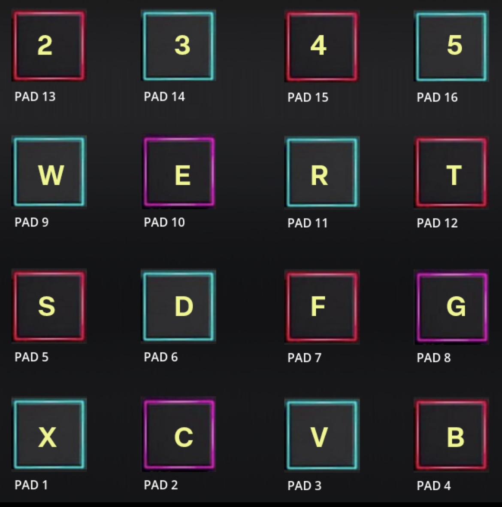

# My MPC

Carregue sons para cada tecla e toque conforme quiser.
As teclas indicadas abaixo acionam loop para os pads indicados.
A tecla M trava o loop.

É possível baixar os executáveis no [link](https://drive.google.com/drive/folders/1rymhzmiCULCPQvpF7lrx5Qb5QQOSIpyv?usp=sharing)